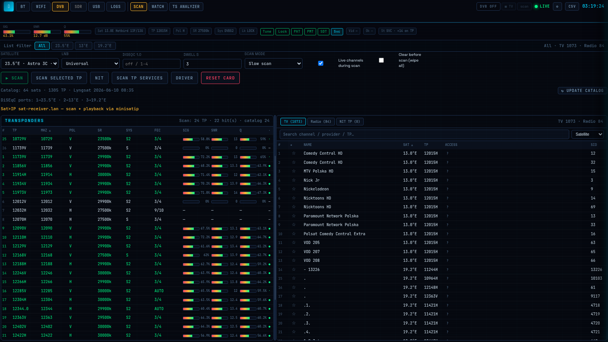

# LE HSCR — SIGINT Radio Monitor



**One local dashboard for Bluetooth LE, Wi‑Fi, and satellite TV — live scans, spectrum, capture, and playback on hardware you control.**

SIGINT Radio Monitor — product code **LE HSCR** (repo `le_hscr`) is a **dense RF lab console** in the browser. Plug in USB Bluetooth and Wi‑Fi adapters (and optionally a DVB‑S tuner or Sat>IP box), open the UI, and work across three radio domains without juggling a dozen terminal tools. BLE devices appear on a radar with iBeacon intelligence; Wi‑Fi networks show spectrum waterfalls and probe traffic; satellite transponders scan, lock, and play FTA channels with live signal meters.

Built for **authorized research** on networks and airspace you own or may legally test — home lab, bench, or field kit. Runs **locally** (Docker Kali recommended); not cloud SaaS.

**Made by [Logic Encoder](https://logicencoder.com)**

**Product name:** SIGINT Radio Monitor · **LE HSCR** · private repo `le_hscr`

Private source: [logicencoder/le_hscr](https://github.com/logicencoder/le_hscr)

---

## Tech stack

| Layer | Technologies |
|-------|----------------|
| API | Python 3, FastAPI, Uvicorn, Pydantic, ORJSON |
| UI | Single-page HTML/JS — canvas/SVG viz; HLS.js + mpegts.js for SAT |
| Real-time | WebSocket wire contract (pytest-validated) |
| BLE | Bleak, BlueZ, btmon; optional Bettercap, Bluelog |
| Wi‑Fi | NetworkManager/nmcli, iw; tcpdump, hcxdumptool, airodump-ng, aircrack-ng |
| Recon | nmap, searchsploit, nikto, arp-scan, wash, routersploit (light) |
| SAT | dvb-tools, ffmpeg; Sat>IP client; optional NVENC |
| Storage | DuckDB session DB; pcap and tooling logs on disk |
| Runtime | Docker (Kali rolling image) or native Linux |
| Quality | pytest, Playwright E2E, CI smoke on push |

---

## Radio domains

| Domain | In plain language |
|--------|-------------------|
| **Bluetooth LE** | See every advertiser in range, track a device, watch a beacon UUID, replay session history, export JSON/CSV |
| **Wi‑Fi** | Scan networks, view spectrum and channel occupancy, sniff probe requests, list clients, capture handshakes, run vuln checks on an AP |
| **Satellite (DVB‑S)** | Scan transponders on a dish, browse TV/radio services, watch FTA in the browser, analyze MPEG transport streams |
| **USB** | See all radios on the bus, recover stuck USB, reset every module in one action |
| **Logs** | Cross-radio KPIs, hardware detection, unified event stream |

Everything updates in **real time** over WebSocket — device lists, spectrum traces, capture status, SAT lock meters, and alerts without refreshing the page.

---

## Operator workflows

#### KPI strip
1. You pin three retail beacons — pinned count stays at 3 while walk-in traffic spikes updates/min without losing your reference devices.
2. Avg RSSI drops 15 dB during a session — you spot interference before a deployment go-live.

#### BLE Control — scan & power
1. Turn **Scan OFF** during a meeting, then **Scan now** for a 10 s snapshot without leaving passive mode all day.
2. **RF reset** after a stuck adapter: power cycles hci0 and scan resumes without rebooting Docker.

#### Active vs passive scan
1. **Active** during a mall walk-through — you discover more unknown advertisers in 60 s.
2. **Passive** in a quiet lab — you avoid extra scan requests while logging adv rate on channel 37 only.

#### Ping area (12 s burst)
1. Before a venue install you run **Ping area** — RSSI chart confirms the beacon is heard at the back door.
2. Compare two booth placements: ping at spot A, move hardware, ping at spot B — strongest signal wins.

#### Radar (classic / pulse)
1. Classic radar during a trade show — see which quadrant new wearables appear from as crowds move.
2. Pulse radar for a demo video — visual pop when a tracked tag re-enters range.

#### Adv traffic waterfall & channels 37/38/39
1. Waterfall shows adv/s spike at 14:05 — correlates with a vendor turning on 50 new tags.
2. Channel strip shows traffic stuck on 38 — you relocate a noisy USB3 hub away from the BT dongle.

#### RSSI heatmap & event log
1. 60 s heatmap while walking a hallway — color band shows where a fixed beacon fades.
2. Filter log to **New** only — ignore repeat packets from phones you already catalogued.

#### Device list — search, track, export
1. Search `Apple` — isolate AirPods and export **CSV** for a client report.
2. Enable **Tracked** filter — watch five contractor badges only during an event teardown.

#### Device detail — iBeacon watch & RSSI chart
1. Watch UUID `E2C56DB5-...` — get alerted when that UUID returns even if MAC randomizes hourly.
2. 60 min chart shows RSSI sawtooth — device is on a moving cart, not stationary.

#### BT Tools — Bettercap / Bluelog / replay
1. Import a **Bluelog** CSV from yesterday and overlay manufacturers on today's scan.
2. **Replay** DuckDB at 4× speed — prove a beacon was absent during a security window.

#### BLE alerts
1. Rule: alert when UUID watchlist device RSSI > −55 — security knows VIP tag entered the floor.
2. Toast + beep when a banned manufacturer ID reappears after you cleared the session.

#### Wi‑Fi Scan — networks & spectrum
1. Rescan after moving AP — waterfall shows channel 6 congestion; you move SSID to channel 11.
2. MHz zoom on trace isolates a narrow spur on 2.437 GHz — faulty microwave in break room.

#### Wi‑Fi Probes
1. See phones probing `CorpWiFi-Guest` that no longer exists — cleanup stale SSID from marketing.
2. Export probe CSV — top SSID chart shows `FreeAirport` is the most probed name in the lobby.

#### Wi‑Fi Clients (airodump)
1. Start airodump on monitor radio — list shows laptop stuck on old AP while phone roams correctly.
2. Clear clients feed between tests so only post-change associations appear.

#### Wi‑Fi Capture & handshake lab
1. 30 s **Handshake lab** on your lab AP BSSID — download hc22000 when EAPOL appears.
2. tcpdump capture during a controlled client reconnect — pcap for Wireshark review class.

#### Wi‑Fi Lab — deauth & analytics
1. **Deauth check** on your own test SSID — confirm injection works before a red-team exercise.
2. DuckDB cross-radio: same vendor OUI seen on BLE list and Wi‑Fi probe — one vendor, two radios.

#### Wi‑Fi Adapter — connect & hotspot
1. Connect managed radio to `Lab-5G` for internet while monitor radio sniffs probes.
2. Start **hotspot** `SIGINT-AP` — connect a phone for isolated capture demos.

#### Wi‑Fi vuln scan (AP detail)
1. Click home router row → **vuln scan** — nmap + searchsploit lists known CVEs for that firmware family.
2. Run wash on lab WPS-enabled AP — document WPS state for hardening checklist.

#### DVB Scan — transponders & services
1. Full scan on 23.5°E — table fills with lock/SNR; you bookmark one FTA news TP.
2. **NIT scan** finds new services after provider reshuffle — update favorites list.

#### DVB Watch — in-browser TV
1. Play FTA news in **MPEG‑TS** mode — sub-second zapping between two TPs on same sat.
2. Switch to **HLS** on a weak TP — player buffers while Sig/SNR meters show margin.

#### DVB TS Analyzer
1. Tune TP — PID table shows video 0x101 + audio 0x102; confirm no unexpected CA PID.
2. SI tree reveals service provider name mismatch — wrong bouquet selected in DiSEqC.

#### USB tab
1. **Emergency recover** when BT dongle vanished after hub glitch — device re-enumerates without host reboot.
2. **Reset ALL** before a client demo — clean BLE/Wi‑Fi/SAT session plus USB refresh in one click.

#### Logs — cross-radio overview
1. Hardware card shows Wi‑Fi monitor missing — you replug dongle before starting capture.
2. Filter **Err** — single pane for BLE scan fail + SAT driver errors during setup.

#### Settings & UI prefs sync
1. Assign wlan1=monitor, wlan0=scan on laptop — settings follow via **ui-prefs** to desktop browser on LAN.
2. Beacon watchlist synced server-side — alert fires on phone browser and bench PC simultaneously.

#### Real-time WebSocket
1. Open UI on two screens — both update when a new BLE device appears; no manual refresh.
2. SAT scan progress bar advances live while you read Wi‑Fi spectrum on another tab.

---

## Dashboard — five main areas

### BT (Bluetooth LE) — default tab

**KPI strip:** pinned devices, recent sightings (120 s), updates per minute, average RSSI, strongest signal, session event count.

**BLE Control:** scan on/off, **active vs passive** mode, scan now, **Ping area** (12 s RSSI burst), Bluetooth power on/off, **RF reset** (adapter cycle).

**Visualization:**
- **Radar** — classic or pulse style; devices by bearing/RSSI
- **Adv traffic** — 60 s waterfall (advertisements per second), channels **37 / 38 / 39**, manufacturer chart, btmon status
- **Heatmap** — 60 s RSSI history; filterable event log (All / New / RSSI / Sys)

**Device list:** search, **Tracked** filter, clear session, export **JSON** or **CSV** from header.

**Device detail drawer:** track device, watch iBeacon UUID, 60‑min RSSI chart, advertisement intelligence (services, manufacturer, proximity estimate, vendor from OUI).

**BT Tools (optional):** start/stop **Bettercap** passive BLE recon, **Bluelog** export/import, **replay** DuckDB timeline at chosen speed.

**Alerts:** server-side rules → WebSocket alert + UI toast/beep when conditions match.

---

### Wi‑Fi — six subtabs

| Subtab | What you do |
|--------|-------------|
| **Scan** | Managed or monitor mode; rescan; RF reset; network list with security/channel/RSSI; click row → detail + **vuln scan**; spectrum **scan/survey**; trace MHz pan/zoom; waterfall; channel occupancy; 2.4 + 5 GHz rows; heatmap |
| **Probes** | Monitor mode; devices sending probe requests; top SSIDs chart; export CSV |
| **Clients** | Start/stop **airodump-ng** feed; client ↔ AP pairs |
| **Capture** | EAPOL capture (tcpdump or hcxdumptool); **handshake lab** (BSSID + optional client, 30 s); download pcap / hc22000 |
| **Lab** | Deauth burst (with injection check); DuckDB Wi‑Fi/BLE analytics; **cross-radio** vendor correlation |
| **Adapter** | List adapters; monitor on/off; connect/disconnect SSID; **hotspot** start/stop |

**Wi‑Fi detail drawer:** network fingerprint, **vuln scan** (nmap + searchsploit; optional arp-scan, wash, nikto, routersploit light).

**Dual-radio setup:** one adapter for everyday scan/connect, second dedicated to monitor — configured in **Settings** so you are not forced to flip one dongle between modes.

---

### DVB (Satellite) — four subtabs

| Subtab | What you do |
|--------|-------------|
| **Scan** | DVB power toggle; pick satellite, LNB, DiSEqC, dwell; full scan, single transponder, NIT scan, service scan; driver setup; card reset; transponder table (signal/SNR/quality/lock) |
| **Watch** | TV/Radio/Favorites lists; play/stop in browser; **MPEG‑TS** or **HLS**; deinterlace; live meters; stream log |
| **TS Analyzer** | SI tree, PID table, live analysis on tuned transponder |
| **Logs** | Scan log; clear/refresh |

**Hardware paths:** local USB DVB‑S (e.g. TechniSat, TBS) **or** **Sat>IP** remote tuner on LAN.

**Power gating:** DVB stays off until you enable it — scans and playback blocked until power on (protects hardware and USB budget).

---

### USB

- KPIs: devices, hubs, buses
- Full device table with rescan
- **Emergency recover** — host USB reset when adapters disappear
- **Reset ALL** — USB recover + clear SAT/BLE/Wi‑Fi session state
- Live attach/detach log

---

### Logs (cross-radio overview)

- Live summary cards: BLE, Wi‑Fi, monitor, DVB
- **Hardware** panel: auto-detected BT, Wi‑Fi, SAT, USB adapters
- Session uptime, event counts, feed health
- Per-module stats (BLE scan, Wi‑Fi scan, capture, BT tools)
- **All Events** stream with filters (All / New / RSSI / Sys / Err)

---

## Global controls (all tabs)

**Settings drawer:**
- Notifications, heatmap colors, font/layout
- Multi-radio Wi‑Fi role assignment (scan vs monitor)
- Spectrum layer toggles
- SAT stream mode (MPEG‑TS vs HLS), transcode vs copy, scan intervals
- **UI prefs sync** to server — layout and beacon watchlist follow you across browsers on the LAN

**Header:** connection indicator, context CSV export, clock.

---

## Real-time behaviour

On connect, WebSocket pushes full snapshots (BLE devices, Wi‑Fi networks, adapters, probe/client history, capture state, logs).

Live updates include:
- New/changed BLE devices and stats ticks
- Wi‑Fi networks, spectrum frames, probe and client rows
- Capture and airodump progress
- SAT scan progress, lock meters, TV play state
- USB topology changes
- Unified log lines and **BLE alerts**

SAT **Watch** also streams **MPEG‑TS** over HTTP or serves **HLS** segments for in-browser playback.

---

## BLE capabilities (detail)

- Continuous scan via Bleak; start/stop; active/passive; auto-start on boot (configurable)
- Adapter power on/off; **Ready** (power + active scan); hardware RF reset
- Vendor lookup (OUI), RSSI, stale/tracked pinning
- **iBeacon**, **Eddystone** (UID/URL/TLM), manufacturer data, service UUIDs, TX power, adv rate
- Optional **GATT fingerprint** per device (server flag — off by default)
- Optional **Ubertooth** capture hook (status when hardware absent)
- **btmon** integration for HCI-level adv traffic
- Session export JSON/CSV; DuckDB replay; cross-radio analytics with Wi‑Fi vendors

---

## Wi‑Fi capabilities (detail)

- **nmcli** managed scan; live network table
- Monitor mode for probes, clients, capture, deauth lab
- Spectrum trace + waterfall + per-channel occupancy (2.4 / 5 GHz)
- Time×network RSSI heatmap
- EAPOL / WPA handshake capture; handshake lab with optional deauth
- Connect/disconnect; software hotspot
- AP vuln scan pipeline (nmap, searchsploit, optional extras)
- DuckDB: channel histograms, SSID tops, timelines
- CSV export: networks, probes, clients

---

## Satellite capabilities (detail)

- Satellite/transponder **catalog** (Lyngsat-derived)
- Auto satellite identify (30°W–90°E range)
- Manual tune; single-TP scan; NIT; service/channel scan
- TV / Radio / NIT service lists; favorites; search/sort
- Browser playback with Sig/SNR/quality/lock/BER
- TS analyzer: CA systems, peers on transponder
- Optional **NVENC** GPU transcode (compose overlay)
- Session restore on restart

---

## How you run it

**Recommended:** Kali Linux in Docker — pentest tools (`iw`, `nmcli`, `tcpdump`, `aircrack-ng`, `bettercap`, …) inside the container; host needs **Docker + USB radios + network**.

```bash
./start-kali.sh
# UI → http://127.0.0.1:8765
```

**Alternative:** native Linux host with tools installed (`SIGINT_FORCE_HOST=1 ./start.sh`).

---

## Hardware you need

| Radio | Typical setup |
|-------|----------------|
| **Bluetooth** | USB dongle or built-in → appears as `hci0` |
| **Wi‑Fi** | USB adapter with **monitor mode**; **two dongles** ideal (scan + monitor at once) |
| **Satellite (optional)** | DVB‑S USB tuner **or** Sat>IP server on LAN with dish/LNB/DiSEqC |
| **Optional** | Ubertooth (advanced BLE capture); NVIDIA GPU for SAT transcode |

Single Wi‑Fi dongle can usually do **scan or monitor**, not both simultaneously — plan for two radios for full Wi‑Fi lab workflow.

---

**Scope:** a local lab bench for radios you own — real USB adapters required; the satellite side needs a tuner or a Sat>IP feed, and the Ubertooth dongle unlocks its full UI. Deauth, capture, and vulnerability tools are built for your own lab networks. Captures, the session database, and `.env` stay on your machine.


## Related repositories

| Repository | Role |
|------------|------|
| [le_hscr](https://github.com/logicencoder/le_hscr) | Private application code |
| [le-hscr-overview](https://github.com/logicencoder/le-hscr-overview) | This product overview |

See [REPOS.md](REPOS.md).

---

**Made by [Logic Encoder](https://logicencoder.com)** · [GitHub](https://github.com/logicencoder) · [Contact](https://logicencoder.com/contact/)
